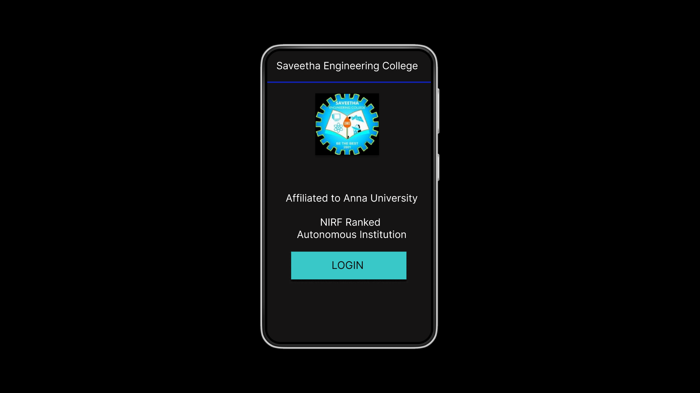
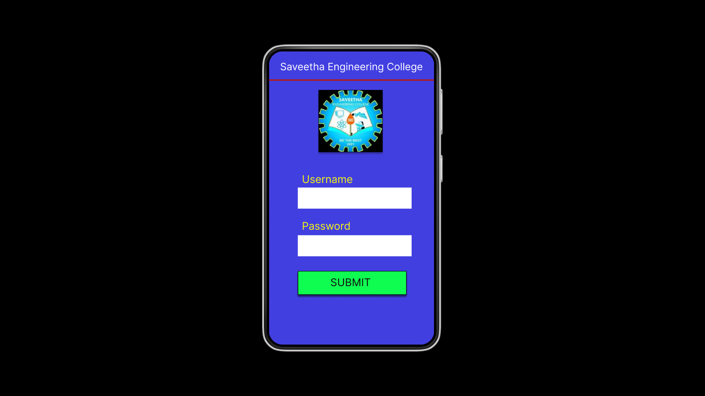
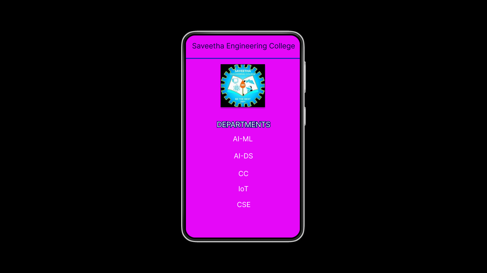

# Event Registration Web Application

## AIM:
To design, develop and deploy a web application for event registration.

## DESIGN STEPS:

### Step 1:
Create a new frame.

## Step 2:
Select any one preset size of your choice.

## Step 3:
Select the shapes you need.

## Step 4:
Import images as needed.

## Step 5:
Create pages based on your need and link them.

## Step 6:
Validate the HTML and CSS code.

## Step 6:
Publish the website in the given URL.

## DESIGN TOOL:
Figma

# PROGRAM:
```
/* Home Page */

position: relative; width: 360px; height: 640px; background: #151414;

/* Login Page */

position: relative; width: 360px; height: 640px; background: #423FE1;

/* Saveetha Engineering College */

position: absolute; width: 332px; height: 39px; left: 20px; top: 19px;

font-family: 'Inter'; font-style: normal; font-weight: 400; font-size: 23px; line-height: 28px; color: #05073E;

/* Line 3 */

position: absolute; width: 364px; height: 0px; left: 0px; top: 74px;

/* logo 3 */

box-sizing: border-box; position: absolute; width: 140px; height: 136px; left: 110px; top: 91px; background: url(logo.jpg); border: 1px solid #000000; box-shadow: 0px 4px 4px rgba(0, 0, 0, 0.25);

/* DEPARTMENTS */

position: absolute; width: 325px; height: 35px; left: 20px; top: 268px; font-family: 'Inter'; font-style: normal; font-weight: 400; font-size: 23px; line-height: 28px; text-align: center; color: #FFFFFF; border: 2px solid #0A0E6E;

/* AI-ML */

position: absolute; width: 320px; height: 33px; left: 20px; top: 313px; font-family: 'Inter'; font-style: normal; font-weight: 400; font-size: 22px; line-height: 27px; text-align: center; color: #FFFFFF;

/* AI-DS */

position: absolute; width: 320px; height: 36px; left: 22px; top: 367px; font-family: 'Inter'; font-style: normal; font-weight: 400; font-size: 22px; line-height: 27px; text-align: center; color: #FFFFFF;

/* CC */

position: absolute; width: 320px; height: 33px; left: 22px; top: 423px; font-family: 'Inter'; font-style: normal; font-weight: 400; font-size: 22px; line-height: 27px; text-align: center; color: #FFFFFF;

/* IoT */

position: absolute; width: 320px; height: 38px; left: 22px; top: 471px; font-family: 'Inter'; font-style: normal; font-weight: 400; font-size: 22px; line-height: 27px; text-align: center; color: #FFFFFF;

/* CSE */

position: absolute; width: 320px; height: 35px; left: 23px; top: 521px; font-family: 'Inter'; font-style: normal; font-weight: 400; font-size: 22px; line-height: 27px; text-align: center; color: #FFFFFF;
```

## OUTPUT:






## Result:
The program to design, develop and deploy a web application for event registration is completed successfully.


